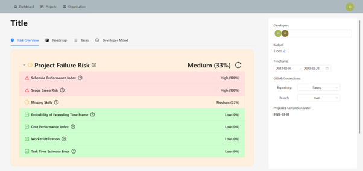
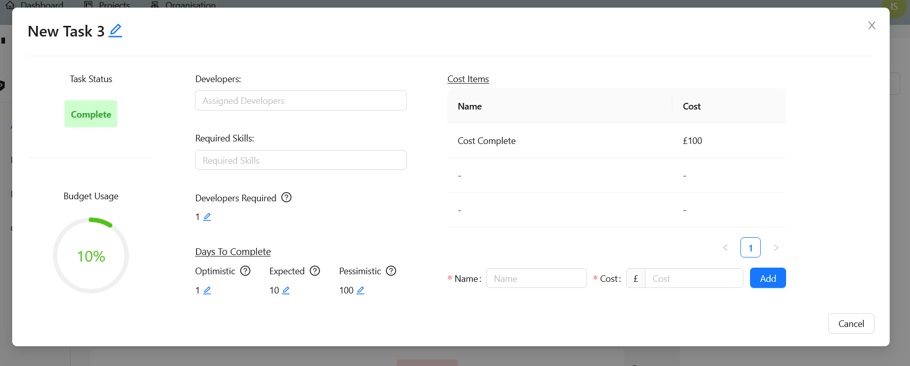
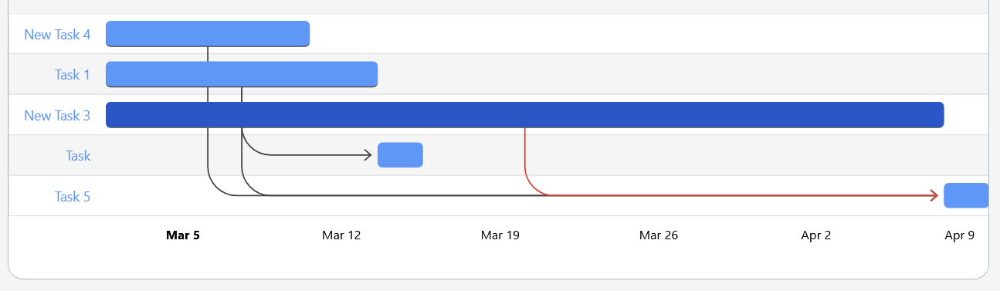
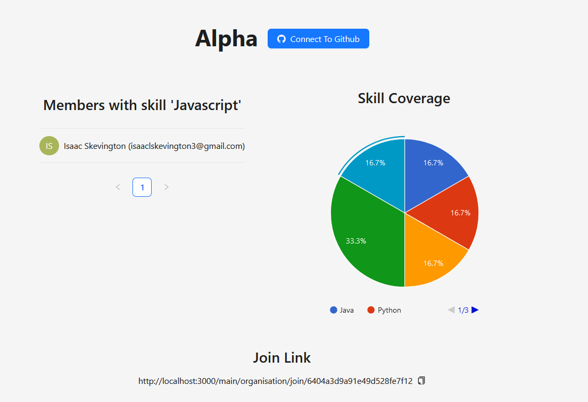
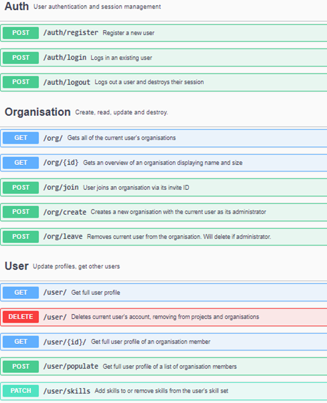
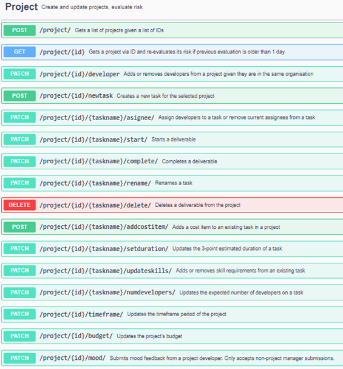
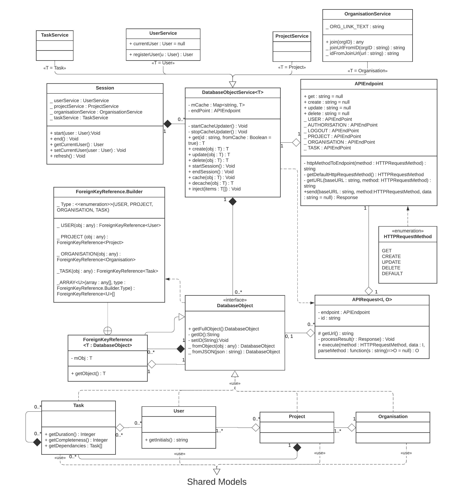

# Software Project Management Platform
A full-stack web application for organisations and developers to seamlessly manage substantial software projects.
Written in Node.js, using the MERN stack (MongoDB, Express.js, React, Node.js).


This project was developed for my Software Engineering Group Project during my University degree.
It has been anonymized by removing the original git history along with documentation pdf files.

## Features
- Dependency based task modelling of projects using PERT and Critical Path method
- Live risk management including prediction and preventative suggestions. Measures risk of railure, and forecasts project completion using statistical data
- Developer surveying to evaluate engagement with project. Collected and summarized to the project manager with in a statistics dashboard
- Integration with GitHub accounts to measure project quality, progress and engagement based on commits, active issues and static code anaylsis.


## Software Design/Frameworks/Libraries
Refers to software implementation details.

- [ant.design](https://ant.design/) React component library
- [Docker compose](https://docs.docker.com/reference/compose-file/) to have a consistent development and testing environment
- [GitHub Actions](https://github.com/features/actions) for a CI/CD pipeline using Docker
- MVC architectural pattern using [Express.js](https://expressjs.com/) as a REST API to implement controllers, [React](https://react.dev/) to create Views, and [mongoose](https://mongoosejs.com/docs/) to create [MongoDB](https://www.mongodb.com/developer/languages/javascript/) and Typescript compatible models
- Role-based authorization with Express.js to ensure correct access and permissions.
- Use of API connectors in the frontend to dynamically control when to call the backend http API or use client cached data.
- Unit and integration testing of backend and frontend carried out using [Jest](https://jestjs.io/).


## Setup
Use the docker-compose file to run the code locally
 
1. Install docker
2. Ensure docker desktop (or the docker daemon if using a terminal) is running
3. Ensure all applications using ports 3000 and 8000 are closed
4. Run the command to create a production build of the app and start it:
    ```bash
    docker compose up --build
    ```

5. Wait for docker to build the codebase (may take around 5-6 minutes the first time and then around 2 minutes for subsequent builds)
6. Navigate to `http://localhost:3000` in a browser to view the running application

- Stopping the application: Ctrl + C or:
    ```bash
    docker compose down
    ```

- Delete saved images: 
    ```bash
    docker image prune -a
    ```

## Codebase Layout

### Frontend

This is the code for the frontend of the application, and includes the following basic
structure

- `src/API` - The API Connectors for the frontend
- `src/Components` - The React components used for displaying the frontend
- `src/Models` - Entities and Object definitions used by the frontend
- `src/Services` - Services used by the frontend to complete common tasks
- `src/test` - Unit tests for the frontend


### Common

This is the code for models used in both the backend and the frontend, and includes the following basic
structure

- `build-models` - The models used by the application after the common package has been built
- `models` - The Mongoose compatible TypeScript models which can be edited

### Backend

This is the code for the backend of the application, using common Express.js practice:

- `middlewares` - Backend middlewares
- `models` - Entities and Object definitions used by the backend
- `routes` - Definitions of API endpoints
- `services` - Services used by the backend to perform tasks
- `types` - TypeScript type overrides and misc. type definitions that are not models

### Testing

- Running tests requires testing dependencies.
- To install them, in the backend, frontend and common directories, run:
    ```bash
    npm install
    ```
- Then run in the location you wish to test
    ```bash
    npm test
    ```

## Images


- Project overview dashboard

<p align="center">
    
</p>

- Project task view

<p align="center">
    
</p>

- Project Gantt Chart

<p align="center">
    
</p>

- Organisation skill overview

<p align="center">
    
</p>

- Swagger UI API Endpoints
<p align="center">
    
    
</p>

- Initial UML Class diagram. This was expanded on during development.

<p align="center">
    
</p>

Want to see more? Run the app youself.